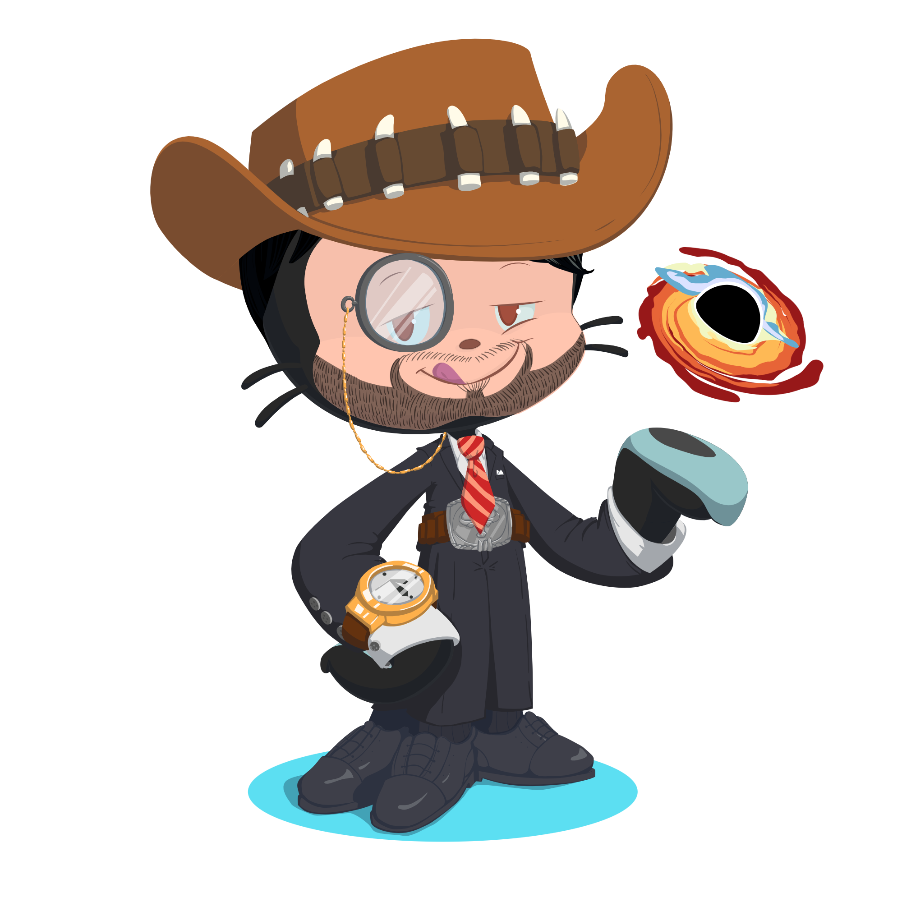

# Hello, I'm Saket Thool
Welcome to my GitHub profile....

## About me

# Here is some information about Me...

* I like to play sports Cricket

* My favorite mobile app is Google
* know the following programming languages
  *  C
  *  C++
  *  HTML
  *  Scratch
  *  Java
  *  Python
* my favorite language currently is Python because It"s very easy to learn and make user easy to understand and read.

# My octocat

